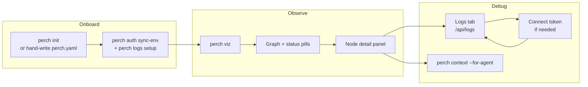
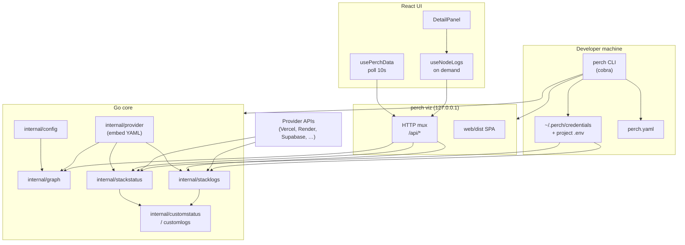

# Codebase guide

Perch is a Go CLI plus an embedded React UI that reads a project `perch.yaml`, loads embedded provider specs, builds a dependency graph, probes live health where credentials allow, and resolves provider logs through a ordered credential strategy chain. The `integrate/platform-and-logs` branch wires `perch viz` as a localhost-only API server (`/api/graph`, `/api/status`, `/api/logs`, `/api/credentials`) so the web stack view stays in sync with the same code paths as `perch status` and `perch logs setup`.

Use **§0** to decide *what the product should be*; use **§1–§4** to see *how this branch implements it*.

---

## 0. Product requirements (PRD)

This section is a working-backwards map: product intent on top, implementation status below. Status reflects **`integrate/platform-and-logs`** (not the full design spec in `.cursor/plans/spec.md`).

### Vision

**One binary** that gives developers and coding agents a unified view of a multi-service stack (Vercel + Render + Supabase + Stripe + Clerk + …) without tab-switching across vendor dashboards.

| Audience | Job to be done | Primary surface today |
|----------|----------------|------------------------|
| Human developer | See what is up/down, open logs, correlate failures | **Web viz** (`perch viz`) + CLI |
| Human developer (power user) | Keyboard-driven exploration in the terminal | **Bubbletea TUI** (graph + status; logs/env/deploy stubbed) |
| Coding agent | Inject stack topology + health into a prompt | **`perch context`**, **`perch graph --json`**, **`perch status --json`** |

**Non-goals (this build):** Perch cloud, hosted dashboard, multi-user auth, provider marketplace, MCP server.

### Product principles

1. **No secrets in git** — `perch.yaml` is committed; tokens live in `~/.perch/credentials` (and optionally project `.env` for import only).
2. **Providers are data** — ~35 bundled YAML files under `providers/`; adding a vendor should not require Go changes for basic GET/status flows.
3. **Same truth everywhere** — Graph, status, and logs share `internal/graph`, `stackstatus`, and `stacklogs`; viz HTTP handlers call the same collectors as CLI.
4. **Local-first** — `perch viz` binds `127.0.0.1`; credential POST from the browser is acceptable only on loopback.
5. **Agent-safe output** — `perch context` must not emit raw env values or tokens (partially true today; deploy/error richness still thin).

### Domain model

| Concept | Meaning | Example |
|---------|---------|---------|
| **Stack** | Named app + environments + edges | `name: my-app` in `perch.yaml` |
| **Environment** | Named slice of the same logical nodes | `production`, `staging`, `dev` |
| **Node** | One service in one environment | `frontend: { provider: vercel, project: my-app }` |
| **Deployable node** | Host you deploy code to; solid border in UI | Vercel, Render, Railway |
| **Read-only node** | Third-party API; dashed border | Stripe, OpenAI, Clerk |
| **Custom node** | Shell `status:` / `logs:` for local dev | `curl localhost:3000/health` |
| **Edge** | Directed dependency | `frontend -> backend -> db` |
| **Provider** | Integration spec (CLI + REST + credential metadata) | `providers/hosting/vercel.yaml` |

### Feature inventory (what exists vs roadmap)

Legend: **Shipped** = usable end-to-end on this branch · **Partial** = works with known gaps · **Planned** = in spec, not implemented · **Stub** = UI/CLI present but no real behavior

#### A. Stack configuration & discovery

| Feature | Description | Status | How users touch it |
|---------|-------------|--------|-------------------|
| `perch.yaml` config | Committed stack definition (nodes, edges, envs) | **Shipped** | Edit file; `perch init` scaffolds |
| `perch init` | Detect providers from config files + `package.json` | **Partial** | No resource picker, reauth, or `perch link` |
| `perch edge` | Add/remove edges in YAML | **Shipped** | CLI |
| Multi-repo / `perch link` | Merge stacks across repos | **Planned** | — |
| Dev port scan (`init --env dev`) | Auto custom nodes from open ports | **Planned** | — |

#### B. Credentials & onboarding

| Feature | Description | Status | How users touch it |
|---------|-------------|--------|-------------------|
| Credential store | `~/.perch/credentials` JSON file | **Shipped** | All auth flows |
| `perch auth sync-env` | Import `.env` → store via `env_aliases` | **Shipped** | CLI |
| `perch config sync-env` | Backfill `perch.yaml` project/service from `.env` | **Shipped** | CLI |
| `perch logs setup` | Install provider CLI + interactive login | **Shipped** | CLI (foreground; before `perch viz`) |
| In-UI token connect | Paste API token when logs auth fails | **Shipped** | DetailPanel → Connect → `POST /api/credentials` |
| `perch provider reauth` | Re-prompt on 401 | **Planned** | — |

#### C. Topology & health

| Feature | Description | Status | How users touch it |
|---------|-------------|--------|-------------------|
| `perch graph` | Stack topology JSON/text | **Shipped** | CLI; `/api/graph` |
| `perch status` | Per-node health report | **Partial** | CLI; `/api/status` |
| SaaS API probes | Live HTTP check for read-only nodes with creds | **Shipped** | Anthropic, Clerk, Pusher, etc. |
| Deployable host status | Vercel/Render/Supabase deployment health | **Stub** | Placeholder “unhealthy” until stack/08 |
| Custom shell status | Run `status:` command | **Shipped** | Dev/custom nodes |
| `perch incidents` | Vendor status pages | **Planned** | — |
| Status polling in viz | Auto-refresh health every 10s | **Shipped** | `usePerchData` |

#### D. Logs

| Feature | Description | Status | How users touch it |
|---------|-------------|--------|-------------------|
| Provider log fetch | Multi-strategy auth → vendor API | **Partial** | Vercel, Render, Supabase only |
| Custom node logs | Shell `logs:` command | **Shipped** | `/api/logs`; copy-paste in UI for custom |
| Logs in web viz | Tab on node detail | **Shipped** | DetailPanel; manual refresh |
| `perch logs --node` stream | CLI tail / follow | **Planned** | — |
| TUI log panel (`l`) | In-terminal tail | **Stub** | Hint only in TUI |
| Cross-node trace / waterfall | `perch trace` | **Planned** | — |

#### E. Deployments & env (spec-heavy)

| Feature | Description | Status | How users touch it |
|---------|-------------|--------|-------------------|
| Deployments tab in viz | Last deploy, errors from status meta | **Partial** | Empty for deployable until status API |
| `perch deploy` / `rollback` | Trigger vendor deploy | **Planned** | — |
| Env vars list/set/diff | `perch env *` | **Planned** | Env tab removed from web UI |
| Snapshots / atomic rollback | Save SHA set, roll back stack | **Planned** | — |
| GitHub integration | Commit lag, blame, PR previews | **Planned** | Optional `github.repo` in YAML unused |

#### F. Surfaces

| Surface | Purpose | Status | Entry |
|---------|---------|--------|-------|
| **CLI** | Scriptable commands, CI, agents | **Partial** | `perch` subcommands |
| **TUI** | Default when running bare `perch` | **Partial** | Graph + status refresh; panels stubbed |
| **Web viz** | Visual graph + node detail | **Shipped** | `perch viz` → browser |
| **Agent JSON** | Machine-readable stack state | **Partial** | `--json`, `context --for-agent` |

#### G. Provider platform

| Feature | Description | Status |
|---------|-------------|--------|
| Bundled provider YAML | Hosting, data, SaaS, AI, observability, workflows | **Shipped** (~35) |
| YAML validation | `make provider-validate` | **Shipped** |
| Community provider registry | `perch provider add/search` | **Planned** |
| LLM usage/cost commands | `perch llm *` | **Planned** |

### User journeys (happy paths on this branch)

1. **New project** — Run `perch init` (or copy an example `perch.yaml`) → add `.env` → `perch auth sync-env`.
2. **Daily dev** — `perch viz` from repo root → pick environment → click unhealthy node → read status errors → open logs tab.
3. **Logs blocked** — Run `perch logs setup` in a real terminal **or** paste token in Connect UI → refresh logs.
4. **Agent handoff** — `perch context --for-agent` + graph JSON for topology; note deployable health may be placeholder.

### Example scenarios in repo

| Path | Role |
|------|------|
| `examples/scenarios/full-stack` | Smoke tests; custom dev nodes + Vercel |
| `examples/scenarios/full-platform` | “Perch Brief” benchmark; many providers |
| `examples/scenarios/init-signals` | Init/detection fixture |
| `examples/scenarios/manual-cli-test` | CLI manual checks |

### Success criteria (this milestone)

What “done” means for **`integrate/platform-and-logs`** before merging to `main`:

- [ ] `./scripts/smoke-stack.sh` passes locally and in CI
- [ ] SaaS nodes with valid creds show **UP** in `perch status` and viz
- [ ] Logs work for at least one deployable + one read-only path after auth
- [ ] No secrets in repo; credentials only in store / local `.env`
- [ ] Stacked PRs #14–#18 merge bottom-up without regressions

### Roadmap (work backwards from here)

Recommended next product increments (see also `docs/DEBT_INVENTORY.md`):

| Priority | Product outcome | Unblocks |
|----------|-----------------|----------|
| 1 | Trustworthy **deployable status** + deploy metadata | Deployments tab, agent context, TUI detail |
| 2 | **TUI logs** (`l`) reusing `stacklogs` | Spec-aligned primary surface |
| 3 | **Env vars** CLI + web tab | `e` keybinding, config debugging |
| 4 | **Deploy / rollback** | `d` panel, snapshots later |
| Defer | Trace, incidents, LLM costs, marketplace | Stretch / V2 |

---

## 1. System architecture

| Path | Role |
|------|------|
| `cmd/perch/main.go` | Binary entry; delegates to `cli.Execute()`. |
| `internal/cli/root.go` | Cobra tree: init, auth, config, context, status, graph, edge, viz, logs. |
| `internal/cli/viz.go` | Local HTTP server, JSON handlers, embedded SPA, browser open. |
| `internal/cli/status.go` | CLI `perch status`; calls `stackstatus.Collect`. |
| `internal/cli/logs.go` | `perch logs setup`: install provider CLIs, interactive auth, persist tokens. |
| `internal/cli/auth.go` | `perch auth sync-env`: import `.env` secrets into credential store. |
| `internal/cli/credentials_load.go` | `loadCollectOptions`, project `.env` parse for probes. |
| `internal/config/` | Find/load `perch.yaml`, node/env validation, configured checks. |
| `internal/provider/` | Embedded provider registry, HTTP helpers, status endpoint templates. |
| `providers/**/*.yaml` | Provider metadata: credentials keys, API endpoints, CLI install/auth. |
| `internal/graph/` | Build graph from config + registry; JSON report for UI. |
| `internal/stackstatus/collect.go` | Per-node status rows; schedules parallel API probes. |
| `internal/stackstatus/probe.go` | REST and signed (Pusher) probes with concurrency cap. |
| `internal/stacklogs/collect.go` | `Resolve`: auth file → env token → store → auto-setup. |
| `internal/stacklogs/vercel.go` | Vercel log fetch strategies and setup hints. |
| `internal/stacklogs/render.go` | Render log resolution. |
| `internal/stacklogs/supabase.go` | Supabase log resolution. |
| `internal/customlogs/` | Shell `logs:` command for `provider: custom` nodes. |
| `internal/customstatus/` | Shell `status:` command for custom health. |
| `internal/credentials/` | File-backed credential store and `.env` import. |
| `web/embed.go` | `go:embed dist` for production UI bundle. |
| `web/src/hooks/usePerchData.js` | Fetches graph + status; 10s polling; mock fallback layout. |
| `web/src/hooks/useNodeLogs.js` | On-demand `/api/logs` fetch per selected node. |
| `web/src/lib/mappers.js` | Merge graph + status JSON into React Flow node model. |
| `web/src/components/DetailPanel.jsx` | Node detail: deployments tab, logs tab, credential connect UI. |
| `web/src/pages/StackView.jsx` | Stack canvas, environment switcher, error banner, detail route. |
| `examples/scenarios/full-stack/perch.yaml` | Reference stack: Vercel/custom per environment. |

## 2. Essential user flows

### Flow A — Open stack visualization (`perch viz`)

| Step | Actor | Action | Outcome |
|------|--------|--------|---------|
| 1 | Developer | Runs `perch viz` (optional `--port`, inherits `--env`) from project root | CWD must contain discoverable `perch.yaml`. |
| 2 | CLI | `loadStackFromWD()` loads config + provider registry | Failure aborts before server start. |
| 3 | CLI | Binds `127.0.0.1`, registers `/api/*`, serves embedded SPA | UI only reachable locally. |
| 4 | CLI | `openBrowser()` opens validated localhost URL | macOS/Windows/Linux launcher. |
| 5 | Browser | Loads SPA; `usePerchData(env)` calls `/api/graph` and `/api/status` | Graph layout + health pills update every 10s. |
| 6 | Developer | Clicks a node → route includes `nodeId` → `DetailPanel` mounts | Deployments + logs tabs available. |

### Flow B — Live status in UI and CLI (`/api/status` / `perch status`)

| Step | Actor | Action | Outcome |
|------|--------|--------|---------|
| 1 | Client | GET `/api/status?env=` (or CLI with `--env`) | Unknown env → 400 JSON error. |
| 2 | `stackstatus.Collect` | Walks sorted node names for environment | One `NodeReport` per node. |
| 3 | Custom nodes | Runs `status:` shell via `customstatus.Run` | `status_source: shell`; optional metrics in JSON. |
| 4 | Deployable hosts | Marks placeholder unhealthy | Detail: deployable API not implemented yet. |
| 5 | SaaS with creds | Enqueues `probeJob`; `probeJobsParallel` hits provider status API | `status_source: api`, `healthy` from HTTP result. |
| 6 | App-only config | `configuredViaAppEnv` (e.g. Inngest dev, Neon `DATABASE_URL`) | Healthy without Perch credential. |
| 7 | UI | `mapGraphToNodes` merges status into cards | Degraded if `error_rate ≥ 0.01`. |

### Flow C — Provider logs in detail panel (`/api/logs`)

| Step | Actor | Action | Outcome |
|------|--------|--------|---------|
| 1 | UI | User opens **logs** tab; first visit triggers `fetchLogs()` | Custom nodes skip API (show copy-paste commands). |
| 2 | Hook | `useNodeLogs` GET `/api/logs?node=&env=` | Resets state when node/env changes. |
| 3 | Server | 8s context timeout (`logsRunTimeout`) | Prevents hung shell/API calls blocking handler. |
| 4 | Custom | `customlogs.Run` on node `logs:` command | Returns stdout/stderr lines, exit code, timeout flags. |
| 5 | Provider | `stacklogs.Resolve` tries strategies in order | Success → `source` set; lines truncated at 4000. |
| 6 | UI | `source === 'none'` → `LogsSetupConnect` | Dashboard link, token POST, retry, `token_expired` hint. |
| 7 | UI | Success → monospace log view with source footer | Manual **Refresh** only (no log polling). |

### Flow D — Credential bootstrap (`perch logs setup`, `perch auth sync-env`, UI connect)

| Step | Actor | Action | Outcome |
|------|--------|--------|---------|
| 1 | Developer | `perch auth sync-env --env-file .env` | Maps provider `env_aliases` into `~/.perch/credentials`. |
| 2 | Developer | `perch logs setup` for deployable nodes | Installs CLI via npm/brew/apt when missing; runs provider `authCmd`. |
| 3 | Setup | `stacklogs.PersistAutoSetupToken` after CLI login | Token available to later `Resolve` / status probes. |
| 4 | UI | User pastes token → POST `/api/credentials` `{ key, token }` | Key must match registry `credentials.key`. |
| 5 | Server | `credentials.Store.Set` | Plain HTTP OK on loopback only (documented in code). |
| 6 | UI | `onRefresh()` re-fetches logs | Strategies may now succeed via `credentials_store`. |

### Critical error paths

| Symptom | Likely cause | Where it surfaces | Mitigation |
|---------|----------------|-------------------|------------|
| Viz fails immediately | No `perch.yaml` in CWD tree | `loadStackFromWD` / stderr before listen | `cd` to stack root; run `perch init`. |
| Graph/status 400 | Bad `?env=` query | `isBadEnvErr` / unknown environment | Match name in `perch.yaml` `environments`. |
| Amber banner in UI | Graph or status fetch failed | `StackView` + stale mock/layout data | Fix server; click navbar refresh; dismiss banner. |
| Logs 400 missing node | Empty `node` query or unknown name | `serveLogsJSON` | Select valid graph node id. |
| Logs empty + setup UI | All strategies failed | `LogResult.Source == "none"` + `setup_hint` | Run `perch logs setup`, `auth sync-env`, or UI **Connect**. |
| Token rejected after save | Provider returned unauthorized | `strategies_tried` includes `token_expired` | Regenerate API token; overwrite credential. |
| Custom logs error | Missing or failing `logs:` shell | 400 or `run_error` in JSON | Fix command in YAML; respect 8s timeout. |
| Deployable always “down” | Placeholder status path | `SourcePlaceholder` in collect | Expected until deployable status API ships; logs may still work. |
| Status probe “missing credential” | No token in store/env for SaaS node | `probeREST` detail | Import secret or complete provider login. |

## 3. Critical code paths

### `internal/cli/viz.go`

**Intent:** Single-process dev server that exposes stack JSON and serves the React app from `go:embed`.

**Key functions:** `runViz`, `serveGraphJSON`, `serveStatusJSON`, `serveLogsJSON`, `serveCredentialsPost`, `spaHandler`, `loadStackFromWD`, `envFromRequest`.

**Bug surfaces:** Assumes process CWD stays the stack root (reload on every request). Write timeout 10s vs logs work up to 8s—tight for slow APIs. Credential POST accepts any known key without CSRF (loopback-only mitigation). SPA fallback always serves `index.html` for missing assets.

### `internal/stackstatus/collect.go` + `probe.go`

**Intent:** Deterministic status report per environment with optional concurrent vendor probes.

**Key functions:** `Collect`, `statusRow`, `shouldProbeAPI`, `probeJobsParallel`, `runProbe`, `probeREST`, `probeSigned`, `configuredViaAppEnv`.

**Bug surfaces:** Deployable nodes never probed (placeholder). Probe index must match `out.Nodes` slice order when jobs append. Signed Pusher path requires `.env` fields easy to misconfigure. Failed probes truncate detail at 80 chars—may hide root cause in UI.

### `internal/stacklogs/collect.go` (+ provider files)

**Intent:** Fetch log lines without forcing manual CLI setup when auth already exists on the machine.

**Key functions:** `Resolve`, `resolveWithFlags`, `tokenFromEnv`, `tokenFromCredentialsStore`, `truncateLines` (`MaxLines = 4000`), provider-specific resolvers.

**Bug surfaces:** Unsupported providers return `source: none` with generic hint—not distinguishable from auth failure. Auto-setup is last resort and mutates global CLI auth state. Platform hooks (`platformHooks`) must stay consistent in tests vs production. Vercel auth file paths omit Windows.

### `internal/cli/logs.go`

**Intent:** Foreground, interactive bootstrap before using viz logs tab.

**Key functions:** `runLogsSetup`, `setupLogsForNode`, `logsAlreadyConfigured`, `logsInstallCommand`.

**Bug surfaces:** Runs `sh -c` install/auth from provider YAML—environment-dependent. Skips non-deployable nodes silently in loop. Does not fail exit code when individual nodes fail (prints ✗ and continues).

### `internal/cli/auth.go`

**Intent:** One-way import from project `.env` into Perch credential store using stack-aware spec list.

**Key functions:** `newAuthSyncEnvCmd`, `credentialSpecsForEnv`, `credentials.ImportEnvFile`.

**Bug surfaces:** Falls back to all registry specs if stack load fails—may import unrelated keys. Skips existing keys unless `--overwrite`; easy to think sync happened when keys were skipped.

### `web/src/hooks/useNodeLogs.js`

**Intent:** Explicit fetch model so logs are not polled across the whole stack.

**Key functions:** `useNodeLogs`, `fetchLogs`, reset effect on `[nodeName, env]`.

**Bug surfaces:** Non-JSON error bodies become generic messages. No abort on rapid node switching (in-flight response can apply to wrong node if timing is unlucky). Does not refetch when credentials connect unless caller awaits `onRefresh`.

### `web/src/components/DetailPanel.jsx`

**Intent:** Node-centric operations: deployment summary from status meta, provider logs or setup UX, custom command copy blocks.

**Key functions:** `ProviderLogsTab`, `LogsSetupConnect`, `ProviderLogsContent`, `buildDeploymentRows`, `selectTab` (lazy log fetch).

**Bug surfaces:** `logsTabFetched` ref does not reset when switching nodes—second node may not auto-fetch logs until manual refresh. Deployment tab documents placeholder status for deployable providers. `credentialKeyForNode` fallback map may drift from Go registry keys.

### `web/src/hooks/usePerchData.js`

**Intent:** Keep canvas in sync with backend graph structure and health.

**Key functions:** `load`, `fetchJson`, 10s `setInterval` polling.

**Bug surfaces:** Initial state is mock graph until first successful fetch—can flash wrong topology. On error, previous nodes remain while banner shows—confusing if env changed. Parallel graph+status means transient partial failure is all-or-nothing error.

## 4. Technical tradeoffs

| Decision | Benefit | Cost |
|----------|---------|------|
| Localhost-only `perch viz` | Simple security story; credential POST without TLS | No shared team dashboard; CWD-tied server |
| Reload stack from disk per API request | Always fresh YAML edits | Repeated registry/config IO; no hot reload cache |
| Status: placeholder for deployable | Avoids false confidence from missing vendor APIs | UI shows deployable as unhealthy until implemented |
| Logs: multi-strategy credential discovery | Works with existing CLI logins and `.env` | Hard to debug; `strategies_tried` must be read carefully |
| Logs: 8s server timeout | Protects viz handler | Truncated/incomplete logs for slow providers |
| UI: poll status/graph 10s, logs on demand | Lower load; predictable API cost | Logs stale until user refreshes; status lag up to 10s |
| Embedded provider YAML | Single binary distribution | Behavior changes require rebuild, not runtime config |
| Merge graph + status in frontend | Single graph schema; status evolves independently | Mapper must stay aligned with Go JSON tags |
| `perch logs setup` interactive auth | Highest success rate for OAuth-like CLIs | Not CI-friendly; duplicates UI connect path |

**Production-oriented notes**

- Run `perch viz` only on trusted machines; treat `~/.perch/credentials` like a password manager vault file (permissions, backup policy).
- Prefer `perch auth sync-env` in documented onboarding so CLI status probes and viz share the same store as provider env vars.
- For deployable nodes, treat status pills as structural until deployable status APIs land; validate logs and custom `status:` commands separately.
- When debugging log setup, inspect JSON `strategies_tried` and `setup_hint` before re-running setup—avoid repeated CLI installs.
- Keep `perch.yaml` environment node names aligned across envs so edges and UI routes stay stable when switching the navbar environment.
- Build the web bundle before release (`web/dist`) so `go:embed` serves current UI assets.
